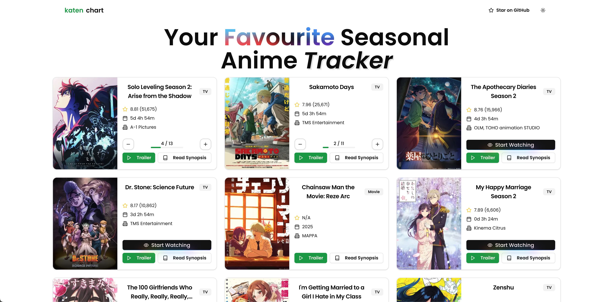

# Katen-Chart

A modern web application for tracking seasonal anime, built with Next.js, Shadcn/ui, and powered by the Jikan API. Features include detailed anime information, countdowns, trailers, and progress tracking.

 <!-- Add a screenshot if available -->

## Features

- **Seasonal Anime Overview**: Browse anime currently airing in the current season.
- **Detailed Information**: View ratings, studio names, synopsis, and more.
- **Next Episode Countdown**: Real-time countdown to the next episode release.
- **Progress Tracking**: Update and track the number of watched episodes (stored locally).
- **Responsive Design**: Optimized for mobile and desktop.
- **Smooth Animations**: Powered by Framer Motion for an enhanced user experience.

## Technologies Used

- **Next.js**: React framework for server-side rendering and static site generation.
- **Shadcn/ui**: Modern UI components built with Radix UI and Tailwind CSS.
- **Jikan API**: Free MyAnimeList API for anime data.
- **Framer Motion**: Animation library for React.
- **Tailwind CSS**: Utility-first CSS framework.
- **date-fns**: Date utility for handling countdown timers.

## Installation

1. **Clone the repository**:
   ```bash
   git clone https://github.com/senbo1/katen-chart.git
   cd katen-chart
   ```
2. **Install dependencies**:

   ```bash
   npm install
   # or
   yarn install
   # or
   pnpm install
   ```

## Running the App

1. **Development**:

   ```bash
   npm run dev
   # or
   yarn dev
   # or
   pnpm dev
   ```

2. **Production Build**:

   ```bash
   npm run build
   npm run start
   ```

   Visit http://localhost:3000 in your browser.

## Contributing

Contributions are welcome! Follow these steps:

1. Fork the repository.
2. Create a feature branch: git checkout -b feat/your-feature.
3. Commit your changes: git commit -m "Add your feature".
4. Push to the branch: git push origin feat/your-feature.
5. Open a Pull Request.
